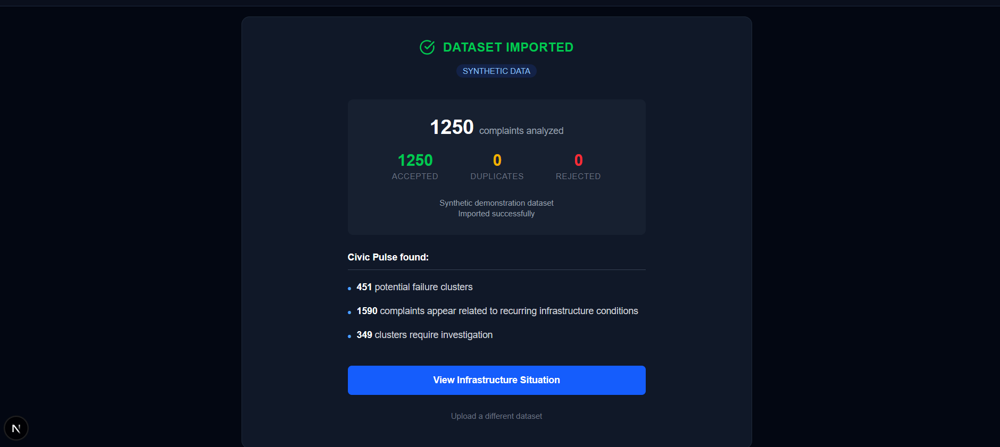
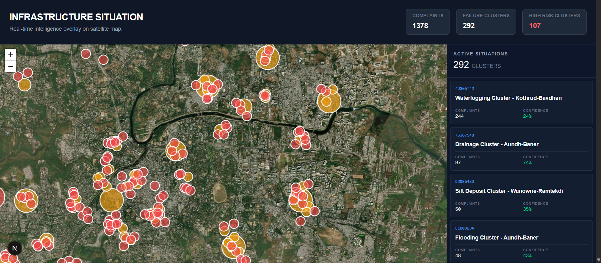
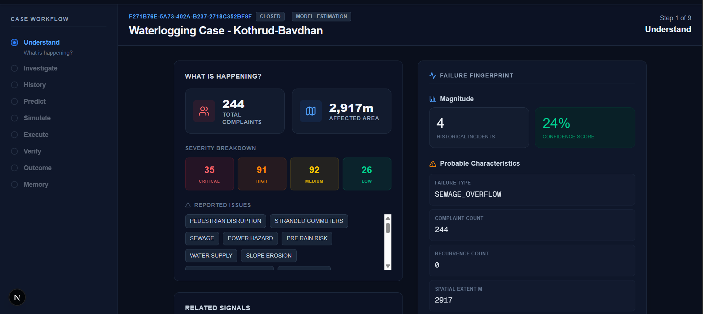
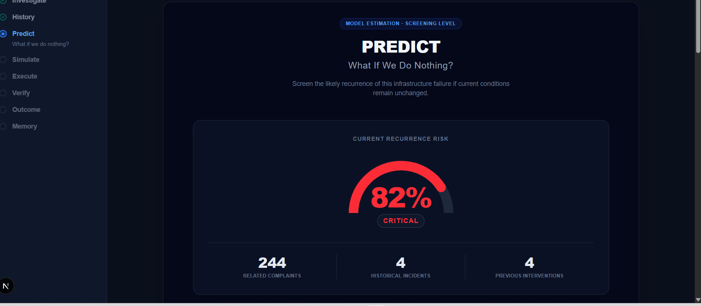
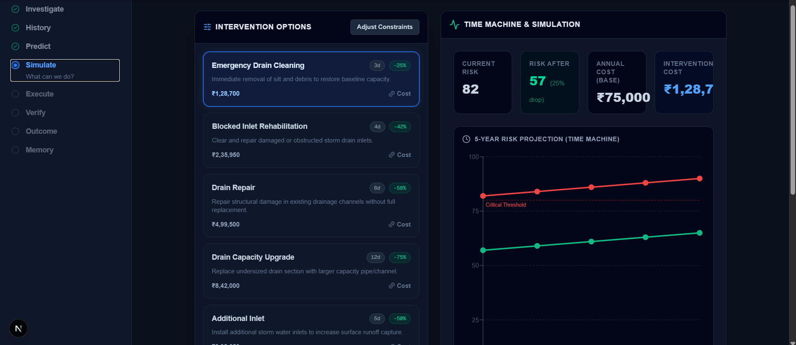
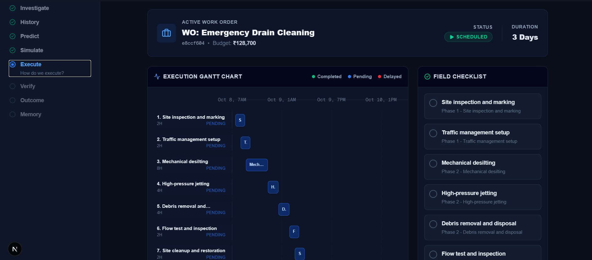

# 🏙️ CivicPulse

> **CivicPulse** is a next-generation Infrastructure Failure Intelligence Platform designed to ingest, analyze, and resolve urban infrastructure issues (like potholes, water leaks, and power outages) with unparalleled speed and analytical rigor.



## 📖 About The Product

Urban infrastructure is complex, and managing its failures shouldn't be chaotic. CivicPulse moves beyond simple ticketing systems by acting as an intelligent orchestrator for municipal and civil maintenance. 

Instead of treating every complaint as an isolated incident, CivicPulse intelligently clusters reports, identifies root causes, and recommends cost-effective interventions. It's built for city planners, civil engineers, and rapid response teams who need actionable intelligence, not just data.



## ✨ Core Features

- **📡 Intelligent Intake:** Seamlessly ingest bulk data (CSV drag-and-drop) and individual reports. CivicPulse normalizes and prepares data for spatial and temporal analysis.
- **🗺️ Situation Awareness (Dynamic Mapping):** Visualize infrastructure health in real-time. The Situation view uses clustering algorithms to group related complaints into "Failure Clusters" on an interactive map.
- **🔍 Case Workspace & Failure Fingerprints:** Dive deep into specific clusters. Each case generates a "Failure Fingerprint" with dynamic metadata, helping teams understand the exact nature of the breakdown.
- **📑 Evidence Ledger:** Maintain a strict, verifiable audit trail of all evidence submitted for a failure, ensuring accountability and context for decision-makers.
- **💡 Intervention Lab:** Automatically generate ranked intervention strategies. CivicPulse analyzes the failure and suggests the best corrective actions based on estimated costs, impact, and historical success.
- **📈 Execution & Memory:** Track the lifecycle of work orders and build a historical database ("Memory") to improve future predictive maintenance.




## 🏗️ System Architecture

CivicPulse is built with a modern, decoupled architecture to ensure scalability and performance.

### Frontend
- **Framework:** Next.js (App Router)
- **Language:** TypeScript
- **Styling:** Tailwind CSS
- **State Management & Fetching:** React Query (`@tanstack/react-query`)
- **Mapping:** Leaflet & React-Leaflet
- **UI Components:** Framer Motion (Animations), Lucide React (Icons), Recharts (Data Visualization)

### Backend
- **Framework:** FastAPI (Python)
- **Database:** PostgreSQL (with SQLite support for rapid local development)
- **ORM:** SQLAlchemy & Alembic
- **Data Validation:** Pydantic
- **Machine Learning & Analysis:** Pandas, NumPy, Scikit-learn, HDBSCAN (for spatial clustering)




## 🚀 Development Setup

### Prerequisites
- Node.js (v18+)
- Python (v3.9+)

### 1. Backend Setup
```bash
cd backend
python -m venv venv
source venv/bin/activate  # On Windows: venv\Scripts\activate
pip install -r requirements.txt

# Run the backend server
uvicorn app.main:app --reload
```

### 2. Frontend Setup
```bash
cd frontend
npm install

# Run the frontend development server
npm run dev
```

The frontend will be available at `http://localhost:3000` and the backend API at `http://localhost:8000`.

## 🌐 Deployment

CivicPulse is designed to be easily deployed to modern cloud platforms.

- **Frontend (Vercel):** Connect your GitHub repository to Vercel, set the Root Directory to `frontend`, and configure the `NEXT_PUBLIC_API_URL` environment variable to point to your backend.
- **Backend (Render):** Deploy as a Web Service on Render using the `backend` directory. Use the build command `pip install -r requirements.txt` and the start command `uvicorn app.main:app --host 0.0.0.0 --port $PORT`. Attach a PostgreSQL database for persistent storage.

---
*Built to empower cities, engineer resilience, and predict the unpredictable.*